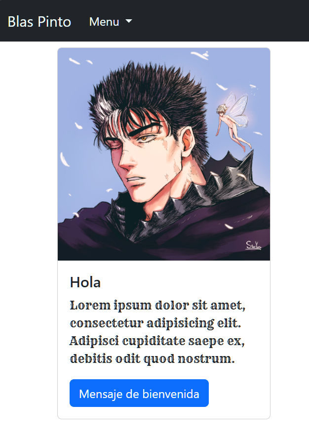

# Tarjeta de Usuario

## Tecnologías
- HTML
- CSS
- JS
- BootStrap

## Contribuciones
1. Haz un fork.
2. Crea una rama (`git checkout -b main`).
3. Haz commit (`git commit -m 'first commit'`).
4. Haz push (`git push origin main`).
5. Abre un Pull Request.
6. Usar Js

## Licencia
Proyecto bajo la Licencia MIT.

## Autor
 [blaspinto5].
